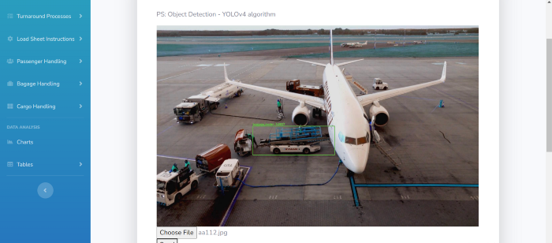

# **YOLOv4 Training On Custom Dataset**


## Table of Content :mag_right:

- [Introduction](#Introduction)
- [Tarining the YOLOv4 model](#tarining-the-yolov4-model)
- [Technologies](#Technologies)
- [Results](#Results)
- [Citation](#Citation)
- [Authors](#Authors)

# Introduction

*This project was made in the framework of holberton school as final project.*

I retrained the yolov4 model to detect custom objects (airport apron equipment). I used the neural network framework darknet.

# Tarining the YOLOv4 model

This notebook contains steps to train the model - [yolov4-training-custom](./yolov4_training_custom_dataset.ipynb)

# Technologies


These are the important technologies to mention in this project:

* **Google colab notebook:** benefit from the free GPU to train the model.
* **OpenCV:** Use its modules to load the model and make the predictions.
* **Nvidia Cuda:** make it possible for the OpenCV DNN module to work.
* **Flask framework:** backend for the web application.
* **Anaconda:** To make an isolated environment to run the application.
* **Online CVAT:** It is the computer vision annotation tool used to prepare the dataset for the training.
# Results
## Make predictions on videos:
***Sample 1***


***Sample 2***


***Sample 3***


## Make predictions on images:
This task was implemented into a flask web application, here is an output sample:

# Citation
```
@misc{darknet13,
  author =   {Joseph Redmon},
  title =    {Darknet: Open Source Neural Networks in C},
  howpublished = {\url{http://pjreddie.com/darknet/}},
  year = {2013--2016}
}
```

```
@misc{bochkovskiy2020yolov4,
      title={YOLOv4: Optimal Speed and Accuracy of Object Detection},
      author={Alexey Bochkovskiy and Chien-Yao Wang and Hong-Yuan Mark Liao},
      year={2020},
      eprint={2004.10934},
      archivePrefix={arXiv},
      primaryClass={cs.CV}
}
```

# Authors

<p align='center'> Ahlem Kaabi <p>

<p align='center'>
  <a href="https://www.linkedin.com/in/k-ahlem/">
    
  </a>
</p>